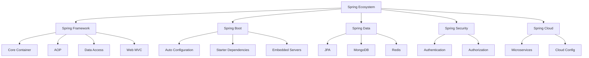

# Evolution from J2EE to Spring Ecosystem
### J2EE (Java 2 Platform, Enterprise Edition)

#### What was J2EE?
J2EE was the original enterprise Java platform introduced in 1999.

#### J2EE Components:
- **EJB (Enterprise JavaBeans)**: Business logic components
- **Servlets**: Handle HTTP requests
- **JSP**: Dynamic web pages
- **JMS (Java Message Service)**: Asynchronous messaging
- **JNDI (Java Naming and Directory Interface)**: Naming services

#### Problems with Traditional J2EE:
- **Complex Configuration**: Too much XML  
- **Heavy**: Required full application servers (JBoss, WebLogic)  
- **Slow Development**: Lengthy development cycles  
- **EJB Complexity**: Overly complicated for simple tasks  
- **Testing Difficulty**: Hard to unit test  

### The Spring Revolution

#### What is Spring?
Spring Framework emerged in 2003 as a lightweight alternative to J2EE.

#### Core Principles:

**1. Dependency Injection (DI)**
Instead of creating objects yourself, Spring creates and manages them.

```java
// Old way (tight coupling)
public class OrderService {
    private PaymentService paymentService = new PaymentService();
}

// Spring way (loose coupling)
public class OrderService {
    @Autowired
    private PaymentService paymentService;
}
```

**2. Inversion of Control (IoC)**
Framework controls object lifecycle, not the developer.

**3. Aspect-Oriented Programming (AOP)**
Separation of cross-cutting concerns (logging, security, transactions).

```java
@Service
public class BankService {
    
    @Transactional  // AOP: Spring handles transaction automatically
    public void transferMoney(Account from, Account to, double amount) {
        from.debit(amount);
        to.credit(amount);
    }
}
```

### Spring Ecosystem



### Comparison: J2EE vs Spring

| Feature | J2EE | Spring |
|---------|------|--------|
| **Configuration** | XML-heavy | Annotation-based, minimal XML |
| **Server Requirement** | Full app server needed | Lightweight, embedded servers |
| **Learning Curve** | Steep | Moderate |
| **Development Speed** | Slow | Fast |
| **Testing** | Difficult | Easy (POJO-based) |
| **Flexibility** | Less flexible | Highly modular |
| **Community** | Corporate-driven | Community + Corporate |

### Spring Boot: The Game Changer

Spring Boot (2014) further simplified Spring development:

```java
@SpringBootApplication
public class MyApplication {
    public static void main(String[] args) {
        SpringApplication.run(MyApplication.class, args);
    }
}

@RestController
public class HelloController {
    @GetMapping("/hello")
    public String hello() {
        return "Hello, Spring Boot!";
    }
}
```

**Benefits:**
-  Create standalone applications
-  Embed Tomcat/Jetty directly
-  No XML configuration needed
-  Production-ready features (health checks, metrics)
-  Quick project setup

---
