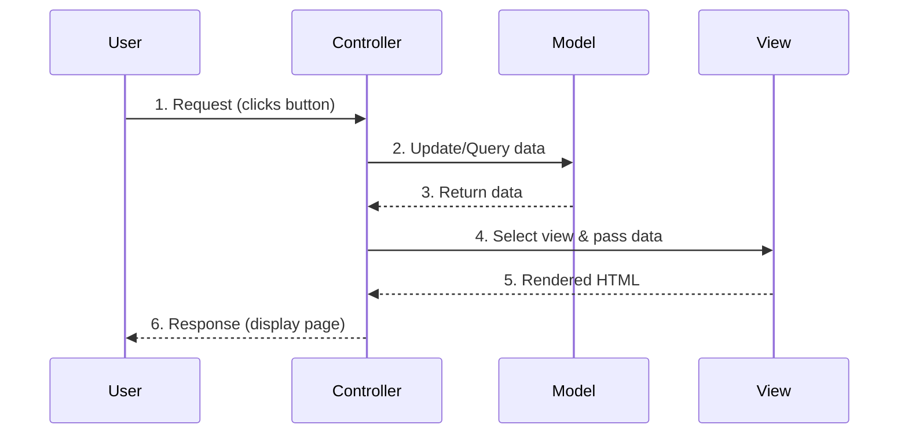

# MVC Architecture
### What is MVC?

**MVC** stands for **Model-View-Controller**, a design pattern that separates application into three interconnected components.

### The Three Components

#### 1. **Model** 
- Represents data and business logic
- Manages application state
- Independent of user interface

**Example:**
```java
public class Product {
    private int id;
    private String name;
    private double price;
    private int quantity;
    
    // Getters and setters
    public int getId() { return id; }
    public void setId(int id) { this.id = id; }
    // ... other getters and setters
    
    // Business logic
    public double calculateTotal() {
        return price * quantity;
    }
}
```

#### 2. **View** 
- Presents data to user
- User interface layer
- Displays information from Model

**Example (JSP):**
```jsp
<%@ page contentType="text/html;charset=UTF-8" %>
<html>
<head>
    <title>Product Details</title>
</head>
<body>
    <h1>${product.name}</h1>
    <p>Price: $${product.price}</p>
    <p>Quantity: ${product.quantity}</p>
    <p>Total: $${product.calculateTotal()}</p>
</body>
</html>
```

#### 3. **Controller** 
- Handles user input
- Updates Model
- Selects View to display

**Example (Servlet):**
```java
@WebServlet("/product")
public class ProductController extends HttpServlet {
    
    protected void doGet(HttpServletRequest request, 
                         HttpServletResponse response) 
                         throws ServletException, IOException {
        
        // Get data from request
        int productId = Integer.parseInt(request.getParameter("id"));
        
        // Interact with Model
        ProductDAO dao = new ProductDAO();
        Product product = dao.getProductById(productId);
        
        // Set data for View
        request.setAttribute("product", product);
        
        // Forward to View
        RequestDispatcher dispatcher = 
            request.getRequestDispatcher("productView.jsp");
        dispatcher.forward(request, response);
    }
}
```

### MVC Flow Diagram



### Benefits of MVC

- **Separation of Concerns**: Each component has specific responsibility  
- **Parallel Development**: Multiple developers can work simultaneously  
- **Reusability**: Models can be used by multiple views  
- **Maintainability**: Changes in one layer don't affect others  
- **Testability**: Easy to test each component independently  

### MVC in Spring Framework

```java
// Model
@Entity
public class Student {
    @Id
    private int id;
    private String name;
    private String email;
    // getters and setters
}

// Controller
@Controller
@RequestMapping("/students")
public class StudentController {
    
    @Autowired
    private StudentService studentService;
    
    @GetMapping("/{id}")
    public String getStudent(@PathVariable int id, Model model) {
        Student student = studentService.findById(id);
        model.addAttribute("student", student);
        return "studentView"; // View name
    }
    
    @PostMapping("/save")
    public String saveStudent(@ModelAttribute Student student) {
        studentService.save(student);
        return "redirect:/students/list";
    }
}

// View (studentView.html - Thymeleaf template)
```

```html
<!DOCTYPE html>
<html xmlns:th="http://www.thymeleaf.org">
<head>
    <title>Student Details</title>
</head>
<body>
    <h1>Student Information</h1>
    <p>Name: <span th:text="${student.name}"></span></p>
    <p>Email: <span th:text="${student.email}"></span></p>
</body>
</html>
```

---
