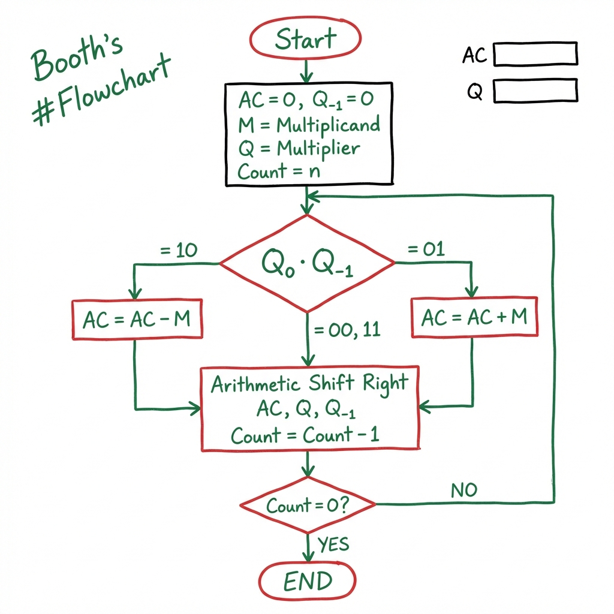
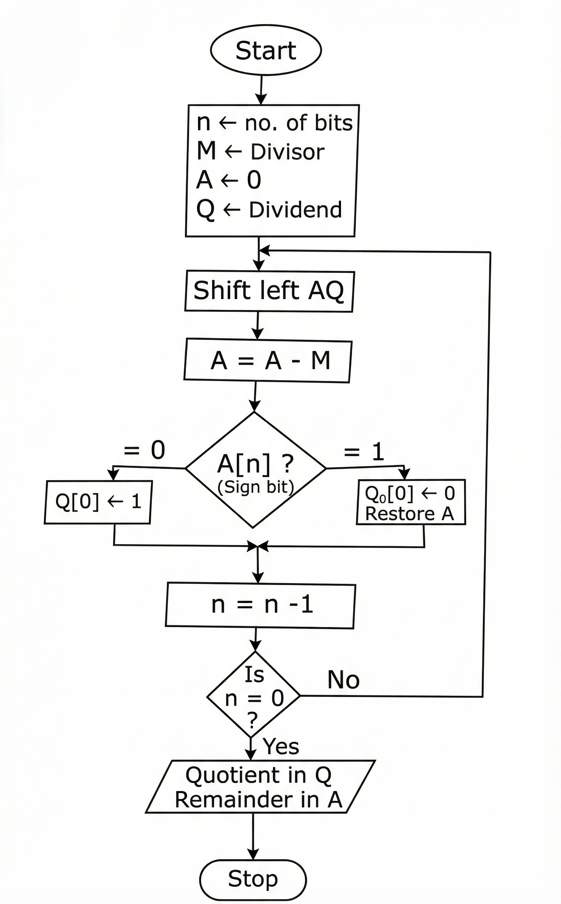

# Computer Arithmetic

---

## 1. Addition & Subtraction

### 1.1 Binary Addition
Binary addition follows the same logic as decimal addition but in base 2.

**Rules:**
- $0 + 0 = 0$
- $0 + 1 = 1$
- $1 + 0 = 1$
- $1 + 1 = 10 \quad$ (Sum 0, Carry 1)
- $1 + 1 + 1 = 11 \quad$ (Sum 1, Carry 1)

### 1.2 Signed Addition & Subtraction (2's Complement)
Modern computers use **2's complement** for signed arithmetic because it simplifies hardware by allowing subtraction to be performed as addition.

**Logic:**  
$A - B = A + (-B)$  
Where $(-B)$ is the 2's complement of $B$.

**Steps to find 2's Complement:**
1.  Invert all bits of the number (1's complement).
2.  Add 1 to the result.

**Example: $7 - 5$ using 4-bit 2's complement**
-   $7 = 0111_2$
-   $5 = 0101_2$
-   $-5 = \text{2's complement of } 0101$
    -   Invert: $1010$
    -   Add 1: $1011$
-   Add: $0111$ ($7$) + $1011$ ($-5$)
-   Result: $10010$
-   Discard carry for fixed-bit width $\rightarrow 0010_2 = 2_{10}$. (Correct)

---

## 2. Multiplication Algorithms

### 2.1 Unsigned Multiplication
Simulates manual "pencil-and-paper" multiplication.
-   **Algorithm:** Partial products are generated and shifted.
-   **Hardware:** Requires an Adder, Multiplicand Register, Multiplier Register (shift right), and Accumulator.

### 2.2 Booth's Multiplication Algorithm
Used for **signed multiplication** (2's complement). It handles positive and negative numbers uniformly without separate correction steps.

**Key Insight:** Strings of 1s in the multiplier (e.g., $00111100$) can be treated as $(2^6 - 2^2)$ instead of four additions, reducing operations.

### Booth's Flowchart

**Decision Table for $Q_0 \cdot Q_{-1}$:**

| $Q_0$ | $Q_{-1}$ | Operation |
|:---:|:---:|:---|
| 0 | 0 | No operation, only ASR |
| 0 | 1 | AC = AC + M, then ASR |
| 1 | 0 | AC = AC - M, then ASR |
| 1 | 1 | No operation, only ASR |

---

### Example 1: Positive × Positive ($7 \times 3$)

**Setup:**
-   **Multiplicand (M):** $(7)_{10} \rightarrow (0111)_2$
-   **Multiplier (Q):** $(3)_{10} \rightarrow (0011)_2$
-   **(-M):** 2's complement of $(0111)_2 \rightarrow (1001)_2$
    -   $0111$
    -   1's complement $\rightarrow 1000$
    -   Add 1 $\rightarrow 1001$
-   **Register Size:** 4 bits
-   **Count:** 4

**Step-by-Step Execution:**

| Step | AC | Q | Q₋₁ | Operation |
|:---:|:---:|:---:|:---:|:---|
| **Initial** | 0000 | 0011 | 0 | Start |
| **1st** | | | | $Q_0 \cdot Q_{-1} = 10$ |
| | 1001 | 0011 | 0 | i) AC = AC - M $(0000 + 1001 = 1001)$ |
| | **1100** | **1001** | **1** | ii) A.S.R. |
| **2nd** | | | | $Q_0 \cdot Q_{-1} = 11$ |
| | **1110** | **0100** | **1** | i) A.S.R. (No add/sub) |
| **3rd** | | | | $Q_0 \cdot Q_{-1} = 01$ |
| | 0101 | 0100 | 1 | i) AC = AC + M $(1110 + 0111 = 0101)$ |
| | **0010** | **1010** | **0** | ii) A.S.R. |
| **4th** | | | | $Q_0 \cdot Q_{-1} = 00$ |
| | **0001** | **0101** | **0** | A.S.R. (No add/sub) |

**Result:**
-   **Final AQ:** $(00010101)_2 = (21)_{10}$
-   **Verification:** $(7)_{10} \times (3)_{10} = +(21)_{10}$ ✓

---

### Example 2: Positive × Negative ($7 \times -3$)

**Setup:**
-   **Multiplicand (M):** $(7)_{10} \rightarrow (0111)_2$
-   **Multiplier (Q):** $(-3)_{10}$
    -   2's complement of 3: $(0011)_2 \rightarrow (1101)_2$
-   **(-M):** 2's complement of $(0111)_2 \rightarrow (1001)_2$
-   **Register Size:** 4 bits
-   **Count:** 4

**Step-by-Step Execution:**

| Step | AC | Q | Q₋₁ | Operation |
|:---:|:---:|:---:|:---:|:---|
| **Initial** | 0000 | 1101 | 0 | Start |
| **1st** | | | | $Q_0 \cdot Q_{-1} = 10$ |
| | 1001 | 1101 | 0 | i) AC = AC - M $(0000 + 1001 = 1001)$ |
| | **1100** | **1110** | **1** | ii) A.S.R. |
| **2nd** | | | | $Q_0 \cdot Q_{-1} = 01$ |
| | 0011 | 1110 | 1 | i) AC = AC + M $(1100 + 0111 = 0011)$ |
| | **0001** | **1111** | **0** | ii) A.S.R. |
| **3rd** | | | | $Q_0 \cdot Q_{-1} = 10$ |
| | 1010 | 1111 | 0 | i) AC = AC - M $(0001 + 1001 = 1010)$ |
| | **1101** | **0111** | **1** | ii) A.S.R. |
| **4th** | | | | $Q_0 \cdot Q_{-1} = 11$ |
| | **1110** | **1011** | **1** | A.S.R. (No add/sub) |

**Result:**
-   **Final AQ:** $(11101011)_2$
-   **Sign bit = 1** → Negative number
-   **Magnitude:** 2's complement of $11101011$:
    -   Invert: $00010100$
    -   Add 1: $00010101 = (21)_{10}$
-   **Final Answer:** $-21$
-   **Verification:** $(7)_{10} \times (-3)_{10} = -(21)_{10}$ ✓

---

### Example 3: Negative × Negative ($-7 \times -3$)

**Setup:**
-   **Multiplicand (M):** $(-7)_{10} \rightarrow (1001)_2$ (2's complement)
-   **Multiplier (Q):** $(-3)_{10} \rightarrow (1101)_2$ (2's complement)
-   **(-M):** 2's complement of $(1001)_2 \rightarrow (0111)_2$
-   **Register Size:** 4 bits
-   **Count:** 4

**Step-by-Step Execution:**

| Step | AC | Q | Q₋₁ | Operation |
|:---:|:---:|:---:|:---:|:---|
| **Initial** | 0000 | 1101 | 0 | Start |
| **1st** | | | | $Q_0 \cdot Q_{-1} = 10$ |
| | 0111 | 1101 | 0 | i) AC = AC - M $(0000 - 1001 = 0000 + 0111 = 0111)$ |
| | **0011** | **1110** | **1** | ii) A.S.R. |
| **2nd** | | | | $Q_0 \cdot Q_{-1} = 01$ |
| | 1100 | 1110 | 1 | i) AC = AC + M $(0011 + 1001 = 1100)$ |
| | **1110** | **0111** | **0** | ii) A.S.R. |
| **3rd** | | | | $Q_0 \cdot Q_{-1} = 10$ |
| | 0101 | 0111 | 0 | i) AC = AC - M $(1110 + 0111 = 0101)$ |
| | **0010** | **1011** | **1** | ii) A.S.R. |
| **4th** | | | | $Q_0 \cdot Q_{-1} = 11$ |
| | **0001** | **0101** | **1** | A.S.R. (No add/sub) |

**Result:**
-   **Final AQ:** $(00010101)_2 = (21)_{10}$
-   **Sign bit = 0** → Positive number
-   **Final Answer:** $+21$
-   **Verification:** $(-7)_{10} \times (-3)_{10} = +(21)_{10}$ ✓

---

## 3. Division Algorithms

### 3.1 Overview
Division ($Dividend \div Divisor = Quotient, Remainder$) is more complex than multiplication as it involves guessing and verifying.

### 3.2 Restoring Division Algorithm (Unsigned)
"Restoring" means if we subtract the divisor and the result is negative (we "guessed" wrong), we add the divisor back to restore the partial remainder.

### Restoring Division Flowchart

**Procedure:**
1.  Initialize $A = 0$, $Q = Dividend$, $M = Divisor$. Count = $n$ (number of bits).
2.  **Shift Left** $A, Q$ combined (discard MSB of A).
3.  **Subtract:** $A \leftarrow A - M$.
4.  **Check Sign of A (MSB):**
    -   If $A[n] = 1$ (A < 0, negative):
        -   $Q_0 = 0$ (Set last bit of Q to 0).
        -   **Restore:** $A \leftarrow A + M$.
    -   If $A[n] = 0$ (A ≥ 0, non-negative):
        -   $Q_0 = 1$ (Set last bit of Q to 1).
        -   Do NOT restore.
5.  Decrement count: $n \leftarrow n - 1$. Repeat if $n \neq 0$.
6.  **Quotient** is in $Q$, **Remainder** is in $A$.

---

### Example: $11 \div 3$ (Restoring Division)

**Problem:** Divide $11$ (Dividend) by $3$ (Divisor) → Expected: Quotient = $3$, Remainder = $2$

**Setup:**
-   **Dividend (Q):** $(11)_{10} \rightarrow (1011)_2$
-   **Divisor (M):** $(3)_{10} \rightarrow (00011)_2$ (5-bit)
-   **(-M):** 2's complement of M = $(11101)_2$
-   **A (Accumulator):** $(00000)_2$ (5-bit)
-   **Register Size:** 4 bits for Q
-   **Count (n):** 4

**Step-by-Step Execution:**

| n | M | A [n+1] | Q | Action/Operation |
|:---:|:---:|:---:|:---:|:---|
| 4 | 00011 | 00000 | 1011 | **Initialization** |
| | | 00001 | 011? | Shift Left AQ (discard MSB of A) |
| | | →11110 | 011? | A = A - M $(00001 + 11101 = 11110)$ |
| | | 00001 | 0110 | A < 0? Yes → $Q_0 = 0$; **Restore A** $(11110 + 00011 = 00001)$ |
| 3 | | 00010 | 110? | Shift Left AQ |
| | | →11111 | 110? | A = A - M $(00010 + 11101 = 11111)$ |
| | | 00010 | 1100 | A < 0? Yes → $Q_0 = 0$; **Restore A** |
| 2 | | 00101 | 100? | Shift Left AQ |
| | | →00010 | 100? | A = A - M $(00101 + 11101 = 00010)$ |
| | | 00010 | 1001 | A ≥ 0? Yes → $Q_0 = 1$; No Restore |
| 1 | | 00101 | 001? | Shift Left AQ |
| | | →00010 | 001? | A = A - M $(00101 + 11101 = 00010)$ |
| | | 00010 | 0011 | A ≥ 0? Yes → $Q_0 = 1$; No Restore |
| 0 | | 00010 | 0011 | **STOP** (n = 0) |

**Result:**
-   **Quotient (Q):** $(0011)_2 = (3)_{10}$
-   **Remainder (A):** $(00010)_2 = (2)_{10}$
-   **Verification:** $11 = 3 \times 3 + 2$ ✓

### 3.3 Non-Restoring Division Algorithm
Instead of adding back $M$ immediately after a negative result, it keeps the negative remainder and adds $M$ in the next step (after shift). It is slightly faster in hardware because it avoids the extra "restore" addition step.

### Non-Restoring Division Flowchart

**Key Difference from Restoring Division:**
- **Restoring:** If A < 0, restore immediately (A = A + M), then shift
- **Non-Restoring:** If A < 0, don't restore! Just shift, then add M in next step

**Procedure:**
1.  Initialize $A = 0$, $Q = Dividend$, $M = Divisor$. Count = $n$ (number of bits).
2.  **Check Sign bit of A:**
    -   If Sign bit = 0 (A ≥ 0): **Shift Left AQ**, then $A \leftarrow A - M$
    -   If Sign bit = 1 (A < 0): **Shift Left AQ**, then $A \leftarrow A + M$
3.  **Set Quotient bit based on result:**
    -   If Sign bit of A = 0: $Q_0 = 1$
    -   If Sign bit of A = 1: $Q_0 = 0$
4.  Decrement count: $n \leftarrow n - 1$. Repeat if $n \neq 0$.
5.  **Final Correction:** If Sign bit of A = 1 (A still negative), add M: $A \leftarrow A + M$ to get correct remainder.
6.  **Quotient** is in $Q$, **Remainder** is in $A$.

---

### Example: $11 \div 3$ (Non-Restoring Division)

**Problem:** Divide $11$ (Dividend) by $3$ (Divisor) → Expected: Quotient = $3$, Remainder = $2$

**Setup:**
-   **Dividend (Q):** $(11)_{10} \rightarrow (1011)_2$
-   **Divisor (M):** $(3)_{10} \rightarrow (00011)_2$ (5-bit)
-   **(-M):** 2's complement of M = $(11101)_2$
-   **A (Accumulator):** $(00000)_2$ (5-bit)
-   **Register Size:** 4 bits for Q
-   **Count (n):** 4

**Step-by-Step Execution:**

| n | M | A | Q | Action/Operation |
|:---:|:---:|:---:|:---:|:---
| 4 | 00011 | 00000 | 1011 | **Initialization** (-M = 11101) |
| | | 00001 | 011? | Shift Left AQ |
| | | 11110 | 0110 | A = A - M; Sign = 1 → $Q_0 = 0$ |
| 3 | | 11100 | 110? | Shift Left AQ |
| | | 11111 | 1100 | A = A + M; Sign = 1 → $Q_0 = 0$ |
| 2 | | 11111 | 100? | Shift Left AQ |
| | | 00010 | 1001 | A = A + M; Sign = 0 → $Q_0 = 1$ |
| 1 | | 00101 | 001? | Shift Left AQ |
| | | 00010 | 0011 | A = A - M; Sign = 0 → $Q_0 = 1$ |
| 0 | | 00010 | 0011 | **STOP** (n = 0) |

**Result:**
-   **Quotient (Q):** $(0011)_2 = (3)_{10}$
-   **Remainder (A):** $(00010)_2 = (2)_{10}$
-   **Verification:** $11 = 3 \times 3 + 2$ ✓

---

### Comparison: Restoring vs Non-Restoring Division

| Feature | Restoring Division | Non-Restoring Division |
|:---|:---|:---|
| **Restore Step** | Always restores if A < 0 | Never restores during iteration |
| **Operations per cycle** | Up to 2 (subtract + restore) | Exactly 1 (add OR subtract) |
| **Hardware Speed** | Slower | Faster |
| **Final Correction** | Not needed | May need if A < 0 |
| **Complexity** | Simpler logic | Slightly more complex |

---
