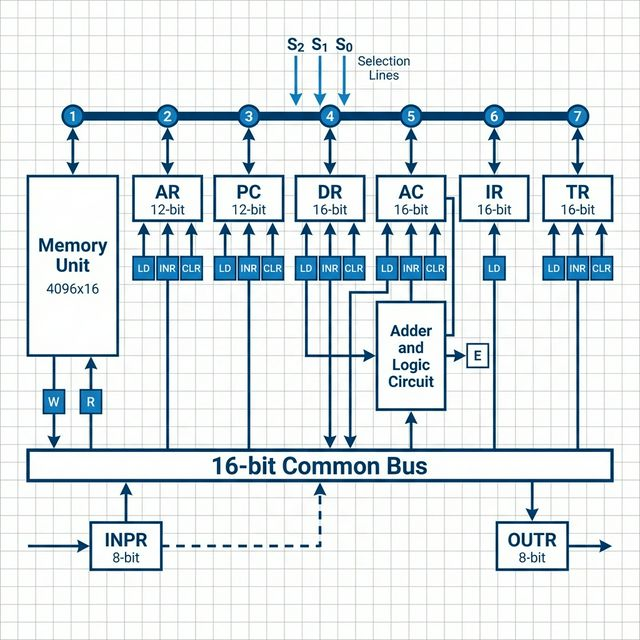

# Common Bus System

## 1. What is a Bus?

A **bus** is a set of **common wires** that connects multiple components (registers, memory, ALU) in a computer.

**Advantage:** Instead of connecting every register to every other register (too many wires!), all registers share **ONE common path**.

---

## 2. Common Bus System Diagram



---

## 3. Bus Selection Table (MUST MEMORIZE!)

| S₂ | S₁ | S₀ | Register Selected |
|----|----|----|-------------------|
| 0  | 0  | 0  | None (000)        |
| 0  | 0  | 1  | AR (001)          |
| 0  | 1  | 0  | PC (010)          |
| 0  | 1  | 1  | DR (011)          |
| 1  | 0  | 0  | AC (100)          |
| 1  | 0  | 1  | IR (101)          |
| 1  | 1  | 0  | TR (110)          |
| 1  | 1  | 1  | Memory (111)      |

**Memory Trick:** 1=AR, 2=PC, 3=DR, 4=AC, 5=IR, 6=TR, 7=Memory

---

## 4. Key Bus Rules

1. **Only ONE register** can put data on the bus at a time
2. **Multiple registers** can read from the bus simultaneously  
3. **Selection lines (S₂S₁S₀)** choose which register sends data
4. **Load signals** determine which registers receive data

---

## 5. Register Control Signals

| Signal | Full Name | Function | Example |
|--------|-----------|----------|---------|
| **LD** | Load | Transfer data into register | AC ← Bus |
| **INR** | Increment | Add 1 to register | PC ← PC + 1 |
| **CLR** | Clear | Reset to zero | AC ← 0 |

---

## 6. Data Transfer Examples

### Example 1: AR ← PC
```
Select: S₂S₁S₀ = 010 (PC on bus)
Load:   AR load signal enabled
Result: AR gets value from PC
```

### Example 2: AC ← DR
```
Select: S₂S₁S₀ = 011 (DR on bus)
Load:   AC load signal enabled
Result: AC gets value from DR
```

### Example 3: M[AR] ← AC (Store to Memory)
```
Select: S₂S₁S₀ = 100 (AC on bus)
Write:  Memory write signal enabled
Result: Memory at address AR gets AC value
```

### Example 4: DR ← M[AR] (Read from Memory)
```
Select: S₂S₁S₀ = 111 (Memory on bus)
Load:   DR load signal enabled
Result: DR gets value from Memory[AR]
```

---

## 7. One-Address Instruction Format

```
  15    14  13  12  11  10   9   8   7   6   5   4   3   2   1   0
┌────┬────────────┬───────────────────────────────────────────────┐
│ I  │  Opcode    │           Address (12 bits)                   │
└────┴────────────┴───────────────────────────────────────────────┘
  │       │                      │
  │       │                      └── Memory address (0-4095)
  │       └── Operation (3 bits = 8 operations)
  └── Indirect bit (0=Direct, 1=Indirect)
```

**Why One-Address?**
- Basic Computer has only **ONE general-purpose register (AC)**
- One operand is always **AC** (implied)
- One operand is **from memory** (specified in instruction)

---

## 8. Example Program: X = (A+B) × (C+D)

### Step-by-Step Program

| Instruction | RTL Notation | Explanation |
|-------------|--------------|-------------|
| **LOAD A** | AC ← M[A] | Get A into AC |
| **ADD B** | AC ← AC + M[B] | AC = A+B |
| **STORE T** | M[T] ← AC | Save (A+B) in T |
| **LOAD C** | AC ← M[C] | Get C into AC |
| **ADD D** | AC ← AC + M[D] | AC = C+D |
| **MUL T** | AC ← AC × M[T] | AC = (C+D) × (A+B) |
| **STORE X** | M[X] ← AC | Save result in X |

### Execution Example (Assume A=5, B=3, C=4, D=6)

```
Step 1: LOAD A     → AC = 5
Step 2: ADD B      → AC = 5 + 3 = 8
Step 3: STORE T    → T = 8 (save A+B)
Step 4: LOAD C     → AC = 4
Step 5: ADD D      → AC = 4 + 6 = 10
Step 6: MUL T      → AC = 10 × 8 = 80
Step 7: STORE X    → X = 80 ✓

Answer: X = 80 = (5+3) × (4+6)
```

---

# Instruction Cycle

---

## 1. What is an Instruction Cycle?

The **instruction cycle** is the process the CPU follows to execute each instruction in a program. It consists of a **sequence of steps** that repeat for every instruction.

**Key Point:** A program executes by going through **a cycle for each instruction**.

---

## 2. Phases of Instruction Cycle

Every instruction cycle has **4 main phases**:

```
┌─────────┐    ┌──────────┐    ┌──────────────┐    ┌─────────┐
│  FETCH  │ →  │  DECODE  │ →  │ OPERAND FETCH│ →  │ EXECUTE │
└─────────┘    └──────────┘    └──────────────┘    └─────────┘
     ↑                                                    │
     └────────────────────────────────────────────────────┘
                    (Repeat for next instruction)
```

| Phase | What Happens |
|-------|--------------|
| **1. Fetch** | Fetch instruction from memory |
| **2. Decode** | Decode the instruction |
| **3. Operand Fetch** | Read effective address from memory (if indirect) |
| **4. Execute** | Execute the instruction |

---

## 3. Timing Signals and Sequence Counter

### The Sequence Counter (SC)

The **sequence counter (SC)** generates timing signals to control each phase.

```
Clock → Sequence Counter (SC) → T₀, T₁, T₂, T₃, T₄, ...
```

**Initially:**
- PC is loaded with the **address of the first instruction**
- SC is initialized to **0**, providing timing signal **T₀**

**Operation:**
- After each clock pulse, **SC is incremented by 1**
- This generates timing signals **T₀, T₁, T₂, T₃, ...**

---

## 4. Fetch Cycle (T₀, T₁)

**MUST MEMORIZE:** Fetch cycle happens at **T₀ and T₁**

### Step 1: T₀ (Transfer Instruction Address)
```
T₀: AR ← PC
```
- Transfer the address of the instruction from **PC to AR**

### Step 2: T₁ (Read Instruction)
```
T₁: IR ← M[AR], PC ← PC + 1
```
- Read instruction from **Memory[AR]** into **IR**
- Increment **PC** for the next instruction

---

## 5. Decode Cycle (T₂)

**At time T₂**, the instruction is decoded:

```
T₂: D₀, D₁, ..., D₇ ← Decode IR(12-14)
    AR ← IR(0-11)
    I ← IR(15)
```

### What Happens:
1. **Operation code** in IR(12-14) is decoded → **D₀ to D₇**
2. **Address part** IR(0-11) is transferred to **AR**
3. **Indirect bit** IR(15) is transferred to flip-flop **I**

### Decoder Output Table:

| IR(12-14) | Decoder Output | Instruction Type |
|-----------|----------------|------------------|
| 000 | D₀ = 1 | AND |
| 001 | D₁ = 1 | ADD |
| 010 | D₂ = 1 | LDA |
| 011 | D₃ = 1 | STA |
| 100 | D₄ = 1 | BUN |
| 101 | D₅ = 1 | BSA |
| 110 | D₆ = 1 | ISZ |
| 111 | D₇ = 1 | Register/IO |

---

## 6. Decision Phase - Determine Instruction Type

### At T₃, we check the instruction type:

**Three possible types:**

1. **Memory-Reference Instructions** (Opcode ≠ 111)
2. **Register-Reference Instructions** (Opcode = 111, I = 0)
3. **Input-Output Instructions** (Opcode = 111, I = 1)

### Instruction Format Decision:

```
┌─────────────────────────────────────────────────────┐
│  Is Opcode = 111?                                    │
└──────────────┬──────────────────────────────────────┘
               │
      ┌────────┴────────┐
      NO               YES
      │                 │
      ▼                 ▼
   D₇ = 0          D₇ = 1
(Memory-Ref)    Check I bit
      │                 │
      │         ┌───────┴────────┐
      │        I=0             I=1
      │         │                 │
      │         ▼                 ▼
      │    Register-Ref      Input-Output
      │   Instructions       Instructions
      │
      ▼
  Check I bit
      │
      ├─── I = 0 (Direct) → Execute at T₃
      │
      └─── I = 1 (Indirect) → T₃: AR ← M[AR], then Execute at T₄
```

---

## 7. Control Flow Equations

### Register-Reference (D₇ = 1, I = 0):
```
D₇I'T₃: Execute register-reference instruction
        SC ← 0
```

### Input-Output (D₇ = 1, I = 1):
```
D₇IT₃: Execute input-output instruction
       SC ← 0
```

### Memory-Reference with Direct Addressing (D₇ = 0, I = 0):
```
T₃: Execute memory-reference instruction
    SC ← 0
```

### Memory-Reference with Indirect Addressing (D₇ = 0, I = 1):
```
T₃: AR ← M[AR]  (Read effective address)
T₄: Execute memory-reference instruction
    SC ← 0
```

---

## 8. Execute Phase

### For Register-Reference or I/O Instructions:
- Execute at **T₃**
- After execution, **SC ← 0** (reset to fetch next instruction)

### For Memory-Reference Instructions:

#### Direct Addressing (I = 0):
```
T₃: Execute the instruction
    SC ← 0
```

#### Indirect Addressing (I = 1):
```
T₃: AR ← M[AR]  (Operand Fetch - get effective address)
T₄: Execute the instruction
    SC ← 0
```

---

## 9. Complete Instruction Cycle Flowchart


---

## 10. Micro-operations Summary

### Fetch Phase (SAME for ALL instructions):
```
T₀: AR ← PC
T₁: IR ← M[AR], PC ← PC + 1
```

### Decode Phase:
```
T₂: D₀...D₇ ← Decode IR(12-14)
    AR ← IR(0-11)
    I ← IR(15)
```

### Indirect Addressing (if I=1 for memory-reference):
```
T₃: AR ← M[AR]
```

### Execute:
- **Register/IO:** Execute at T₃, then SC ← 0
- **Memory-Ref Direct:** Execute at T₃, then SC ← 0
- **Memory-Ref Indirect:** Execute at T₄, then SC ← 0

---
