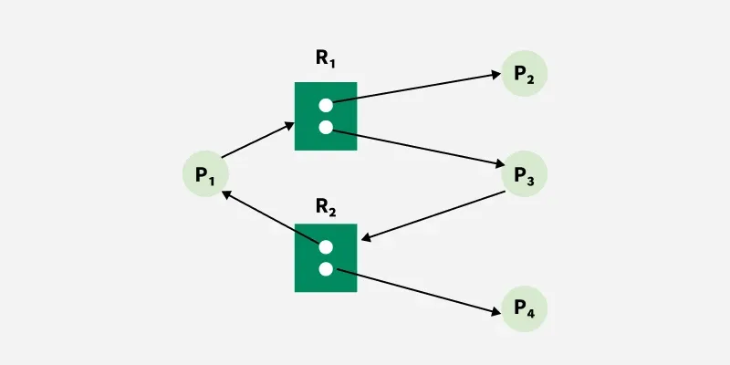

# Deadlock Problem

## What is Deadlock?

A **deadlock** is a situation where **two or more processes are blocked forever**, each waiting for a resource held by the other.

> No process can proceed → system is stuck.

---

## Simple Example

| Process | Holds | Waiting For |
|---------|-------|-------------|
| P1      | R1    | R2          |
| P2      | R2    | R1          |

Both processes wait indefinitely → **Deadlock**.

---

## Real-Life Analogy

- **Traffic Jam at a 4-way crossing**: Each car waits for the other to move first — none can proceed.
- **Two people at a narrow bridge**: Each waits for the other to cross first.

---

## System Model (How Resources Work)

1. **Resource Types**: CPU, memory, printers, files, etc.
2. Each resource type has **one or more instances**.
3. A process uses a resource in 3 steps:

```
Request → Use → Release
```

- **Request**: Process asks for the resource (blocks if unavailable).
- **Use**: Process operates on the resource.
- **Release**: Process frees the resource.

---

## When Does Deadlock Occur?

Deadlock **can occur** when all **four conditions** hold **simultaneously**:

| # | Condition | Meaning |
|---|-----------|---------|
| 1 | **Mutual Exclusion** | At least one resource is non-sharable (only one process can use it at a time) |
| 2 | **Hold and Wait** | A process holds at least one resource and waits for additional resources |
| 3 | **No Preemption** | Resources cannot be forcibly taken away; only the holding process can release |
| 4 | **Circular Wait** | A circular chain of processes exists, each waiting for a resource held by the next |

> **Exam Tip**: These are called **Coffman Conditions** (1971). All four must hold together for deadlock.

---

## Resource Allocation Graph (RAG)

A directed graph used to describe and detect deadlocks.

### Components

| Symbol | Meaning |
|--------|---------|
| **Circle (○)** | Process (P₁, P₂, …) |
| **Square (□)** | Resource type (R₁, R₂, …) |
| **Dot inside □** | Instance of a resource |
| **P → R** (Request Edge) | Process is **waiting** for the resource |
| **R → P** (Assignment Edge) | Resource is **assigned** to the process |

### Key Rules

- **No cycle in RAG** → **No deadlock** (guaranteed).
- **Cycle exists + single instance per resource** → **Deadlock** (confirmed).
- **Cycle exists + multiple instances per resource** → **Deadlock may or may not exist** (need further analysis).

### Example Diagram (Deadlock)


**Explanation of the Diagram**:
1. **Processes**: Represented by circles (**P1**, **P2**, **P3**).
2. **Resources**: Represented by squares (**R1**, **R2**, **R3**).
3. **Edges (Arrows)**:
   - **P1 is waiting for R1, held by P2**
   - **P2 is waiting for R3, held by P3**
   - **P3 is waiting for an instance of R2, whose one instance is held by p1 and other is held by p2**

---

### Example Diagram (No Deadlock)



**Explanation of the Diagram**:

- The system has enough resources to break the cycle.
- At least one process in the cycle can complete and release resources, allowing the remaining processes to proceed.

--- 

## Important Definitions (Quick Revision)

| Term | Definition |
|------|-----------|
| **Deadlock** | Set of processes where each waits for a resource held by another process in the set |
| **Starvation** | A process waits indefinitely but others keep getting served (not the same as deadlock) |
| **Livelock** | Processes keep changing state in response to each other but make no progress |

### Deadlock vs Starvation

| Deadlock | Starvation |
|----------|-----------|
| All processes in the set are blocked | Process is runnable but never scheduled |
| Requires circular wait | Caused by unfair scheduling |
| Cannot resolve without intervention | May resolve eventually |

---

## Likely Exam Questions

1. **Define deadlock with an example.**
2. **State and explain the four necessary conditions for deadlock.**
3. **Draw and explain a Resource Allocation Graph showing deadlock.**
4. **Differentiate between deadlock and starvation.**
5. **Explain the system model for resource usage (Request → Use → Release).**

---
